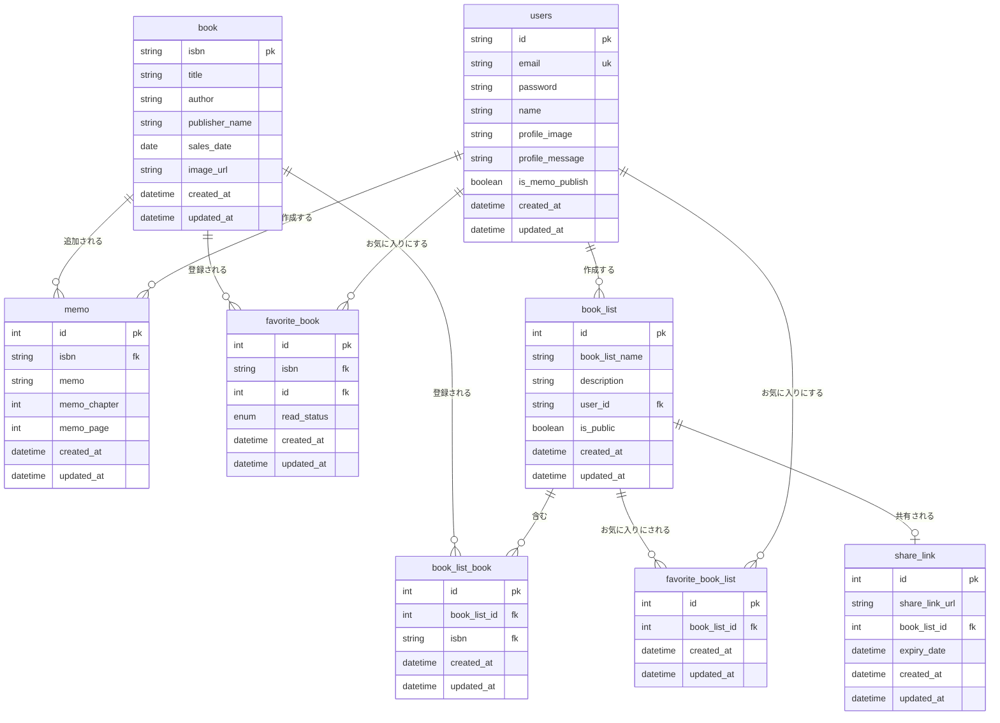

```mermaid
erDiagram
users {
string id pk
string email uk
string password
string name
string profile_image
string profile_message
boolean is_memo_publish
datetime created_at
datetime updated_at
}

book {
string isbn pk
string title
string author
string publisher_name
date sales_date
string image_url
datetime created_at
datetime updated_at
}

memo {
int id pk
string isbn fk
string memo
int memo_chapter
int memo_page
datetime created_at
datetime updated_at
}

favorite_book {
int id pk
string isbn fk
int id fk
enum read_status
datetime created_at
datetime updated_at
}

book_list {
int id pk
string book_list_name
string description
string user_id fk
boolean is_public
datetime created_at
datetime updated_at
}

book_list_book {
int id pk
int book_list_id fk
string isbn fk
datetime created_at
datetime updated_at
}

favorite_book_list {
int id pk
int book_list_id fk
datetime created_at
datetime updated_at
}

share_link {
int id pk
string share_link_url
int book_list_id fk
datetime expiry_date
datetime created_at
datetime updated_at
}

users ||--o{ memo : "作成する"
users ||--o{ favorite_book : "お気に入りにする"
users ||--o{ book_list : "作成する"
users ||--o{ favorite_book_list : "お気に入りにする"
book ||--o{ favorite_book : "登録される"
book ||--o{ memo : "追加される"
book_list ||--o{ book_list_book : "含む"
book ||--o{ book_list_book : "登録される"
book_list ||--o{ favorite_book_list : "お気に入りにされる"
book_list ||--o| share_link : "共有される"
```
