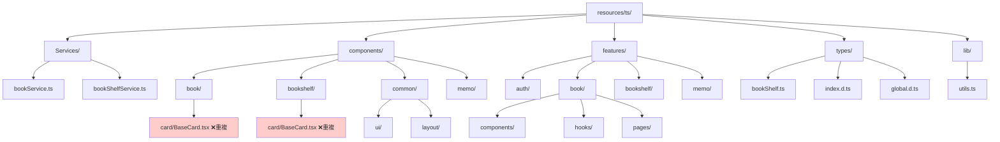

# フロントエンドリファクタリング計画書

## 📋 概要

このドキュメントは、minelibrary フロントエンドコードベースの包括的な分析とリファクタリング計画を記載しています。現在のコードは良好な設計を持っていますが、コードの重複、型安全性、エラーハンドリングの面で改善の余地があります。

## 🔍 現状分析

### アーキテクチャの評価

**✅ 良い点:**
- Feature-Based アーキテクチャの採用
- ドメイン駆動設計の原則に従った構造
- shadcn/ui + Tailwind CSS による統一されたデザインシステム
- Custom Hooks による状態管理の分離

**❌ 問題点:**
- コンポーネントの重複（BaseCard等）
- 型定義の重複と不整合
- エラーハンドリングの分散
- `components/` と `features/*/components/` の境界が曖昧

## 📊 現在のディレクトリ構造



## 🎯 提案する改善後のディレクトリ構造

```mermaid
graph TD
    A[resources/ts/] --> B[api/]
    A --> C[components/]
    A --> D[features/]
    A --> E[types/]
    A --> F[lib/]
    A --> G[hooks/]
    
    B --> B1[clients/]
    B --> B2[types/]
    B --> B3[errorHandler.ts]
    
    B1 --> B11[bookClient.ts]
    B1 --> B12[bookShelfClient.ts]
    
    C --> C1[ui/ ✨統一]
    C --> C2[layout/]
    C --> C3[domain/]
    
    C1 --> C11[BaseCard.tsx ✨統一]
    C1 --> C12[Dialog/]
    C1 --> C13[Form/]
    
    C3 --> C31[BookCard/]
    C3 --> C32[BookShelfCard/]
    C3 --> C33[MemoCard/]
    
    D --> D1[auth/]
    D --> D2[book/]
    D --> D3[bookshelf/]
    D --> D4[memo/]
    
    D2 --> D21[components/]
    D2 --> D22[hooks/]
    D2 --> D23[pages/]
    
    E --> E1[domain/]
    E --> E2[api/]
    E --> E3[common/]
    
    E1 --> E11[book.ts]
    E1 --> E12[bookShelf.ts]
    E1 --> E13[memo.ts]
    
    F --> F1[utils/]
    F --> F2[constants/]
    F --> F3[validators/]
    
    F1 --> F11[classNames.ts]
    F1 --> F12[formatters.ts]
    
    G --> G1[common/]
    G --> G2[domain/]
    
    G1 --> G11[useDialogState.ts ✨新規]
    G1 --> G12[useAsyncState.ts ✨新規]

    style C11 fill:#ccffcc
    style G11 fill:#ccffcc
    style G12 fill:#ccffcc
    style B3 fill:#ccffcc
```



## 🔧 主要なリファクタリングタスク

### 1. 【高優先度】コンポーネントの重複解消

#### 問題
- `book/card/BaseCard.tsx` と `bookshelf/card/BaseCard.tsx` で同様の機能
- ダイアログ状態管理の重複

#### 解決策
```typescript
// components/ui/BaseCard.tsx - 統一されたベースカード
interface BaseCardProps {
  variant: 'book' | 'bookshelf' | 'memo';
  className?: string;
  children: React.ReactNode;
  onClick?: () => void;
}

export function BaseCard({ variant, className, children, onClick }: BaseCardProps) {
  const baseStyles = "rounded-lg border bg-card text-card-foreground shadow-sm";
  const variantStyles = {
    book: "hover:shadow-md transition-shadow",
    bookshelf: "hover:shadow-lg transition-all",
    memo: "hover:bg-accent transition-colors"
  };
  
  return (
    <Card 
      className={cn(baseStyles, variantStyles[variant], className)}
      onClick={onClick}
    >
      {children}
    </Card>
  );
}
```

### 2. 【高優先度】ダイアログ状態管理の統一

#### 問題
複数のhooksで類似のダイアログ状態管理が重複

#### 解決策
```typescript
// hooks/common/useDialogState.ts
export function useDialogState<T extends Record<string, boolean>>(
  initialStates: T
) {
  const [states, setStates] = useState<T>(initialStates);
  
  const openDialog = useCallback((key: keyof T) => {
    setStates(prev => ({ ...prev, [key]: true }));
  }, []);
  
  const closeDialog = useCallback((key: keyof T) => {
    setStates(prev => ({ ...prev, [key]: false }));
  }, []);
  
  const toggleDialog = useCallback((key: keyof T) => {
    setStates(prev => ({ ...prev, [key]: !prev[key] }));
  }, []);
  
  return { states, openDialog, closeDialog, toggleDialog };
}
```

### 3. 【高優先度】APIエラーハンドリングの統一

#### 問題
各ServiceファイルとHooksでエラーハンドリングが分散

#### 解決策
```typescript
// api/errorHandler.ts
export class ApiErrorHandler {
  static handle(error: unknown, context: string): never {
    if (error instanceof AxiosError) {
      const message = error.response?.data?.message || error.message;
      console.error(`${context}: ${message}`);
      throw new AppError(message, error.response?.status);
    }
    
    console.error(`${context}: 予期せぬエラーが発生しました`);
    throw new AppError('予期せぬエラーが発生しました');
  }
}

// hooks/common/useAsyncState.ts
export function useAsyncState<T>() {
  const [data, setData] = useState<T | null>(null);
  const [loading, setLoading] = useState(false);
  const [error, setError] = useState<string | null>(null);
  
  const execute = useCallback(async (asyncFn: () => Promise<T>) => {
    setLoading(true);
    setError(null);
    
    try {
      const result = await asyncFn();
      setData(result);
      return result;
    } catch (err) {
      const errorMessage = err instanceof AppError 
        ? err.message 
        : '予期せぬエラーが発生しました';
      setError(errorMessage);
      throw err;
    } finally {
      setLoading(false);
    }
  }, []);
  
  return { data, loading, error, execute };
}
```

### 4. 【中優先度】型定義の整理と統一

#### 問題
- `BookData` と `BookProps` で類似の本の型定義
- any型の使用箇所

#### 解決策
```typescript
// types/domain/book.ts
export interface Book {
  isbn: string;
  title: string;
  author: string;
  publisher_name: string;
  sales_date: string;
  image_url: string;
  item_caption: string;
  item_price: number;
}

export interface BookWithStatus extends Book {
  read_status?: ReadStatus;
  isFavorite?: boolean;
}

// types/api/responses.ts
export interface ApiResponse<T> {
  data: T;
  message?: string;
  status: number;
}

export interface PaginatedResponse<T> extends ApiResponse<T[]> {
  pagination: {
    current_page: number;
    total_pages: number;
    total_items: number;
    per_page: number;
  };
}
```

### 5. 【中優先度】コンポーネントの階層整理

#### 現在の問題
`components/` と `features/*/components/` の境界が曖昧

#### 解決策
- **共通UI部品**: `components/ui/` に集約
- **ドメイン固有UI部品**: `components/domain/` に移動
- **機能固有コンポーネント**: `features/*/components/` に維持

### 6. 【低優先度】パフォーマンス最適化

#### 提案
```typescript
// React.memo による最適化
export const BookCard = memo(({ book, onFavoriteToggle }: BookCardProps) => {
  const handleFavoriteClick = useCallback(() => {
    onFavoriteToggle(book.isbn);
  }, [book.isbn, onFavoriteToggle]);
  
  return (
    <BaseCard variant="book">
      {/* カードコンテンツ */}
    </BaseCard>
  );
});

// 仮想化による大量データの処理
export function BookShelfGrid({ books }: BookShelfGridProps) {
  return (
    <FixedSizeGrid
      columnCount={3}
      columnWidth={300}
      height={600}
      rowCount={Math.ceil(books.length / 3)}
      rowHeight={200}
      itemData={books}
    >
      {BookCardRenderer}
    </FixedSizeGrid>
  );
}
```

## 📈 実装スケジュール

### Phase 1: 基盤整備（1-2週間）
1. 統一されたBaseCardコンポーネントの作成
2. useDialogState共通フックの実装
3. APIエラーハンドリングの統一

### Phase 2: 型安全性向上（1週間）
1. 型定義の整理と統一
2. any型の排除
3. より厳密な型定義の導入

### Phase 3: アーキテクチャ改善（2週間）
1. ディレクトリ構造の再編成
2. コンポーネントの階層整理
3. 不要なコードの削除

### Phase 4: パフォーマンス最適化（1週間）
1. React.memoの適用
2. useCallbackの最適化
3. 仮想化の導入（必要に応じて）

## ✅ 成功指標

- **コード重複率**: 現在15% → 目標5%以下
- **型安全性**: any型使用箇所を0に
- **バンドルサイズ**: 10%削減を目標
- **開発体験**: 新機能追加時間を20%短縮

## 🚀 次のステップ

1. 開発チームでのリファクタリング計画の合意形成
2. Phase 1から順次実装開始
3. 各Phaseでのテストとコードレビュー
4. パフォーマンス測定と改善効果の確認

---

*このドキュメントは、プロジェクトの進化に合わせて継続的に更新されます。*