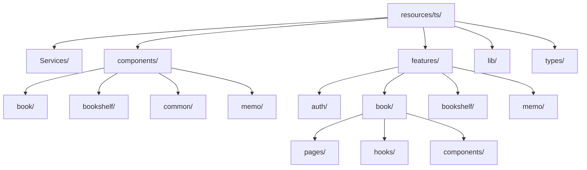
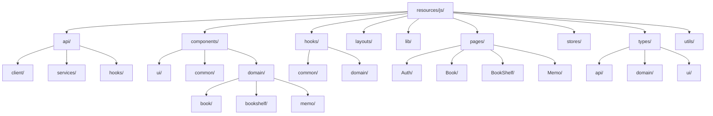

# Laravel 12準拠 移行実装計画

## 🗂️ 現在 → 目標構成の可視化

### 現在のディレクトリ構成


### 目標のLaravel 12拡張構成


## 📋 詳細移行手順

### Phase 1: 基盤移行 (Week 1-2)

#### Step 1.1: ディレクトリ構造作成
```bash
# Laravel 12準拠ベース作成
mkdir -p resources/js/{api/{client,services,hooks},stores,utils}
mkdir -p resources/js/components/{ui,common,domain/{book,bookshelf,memo}}
mkdir -p resources/js/hooks/{common,domain}
mkdir -p resources/js/layouts
mkdir -p resources/js/pages/{Auth,Book,BookShelf,Memo,Profile}
mkdir -p resources/js/types/{api,domain,ui}

# 既存ファイルのコピー（バックアップ）
cp -r resources/ts resources/js-backup
```

#### Step 1.2: 設定ファイル更新
```typescript
// vite.config.ts
export default defineConfig({
    plugins: [
        laravel({
            input: 'resources/js/app.tsx', // ts → js
            refresh: true,
        }),
        react(),
    ],
});

// tsconfig.json
{
    "compilerOptions": {
        "baseUrl": ".",
        "paths": {
            "@/*": ["resources/js/*"] // ts → js
        }
    },
    "include": ["resources/js/**/*"] // ts → js
}
```

### Phase 2: API層統一 (Week 3)

#### Step 2.1: APIクライアント統一
```typescript
// resources/js/api/client/axios.ts
import axios from 'axios';
import { ApiErrorHandler } from '@/lib/errors';

const apiClient = axios.create({
    baseURL: '/api',
    timeout: 10000,
    headers: {
        'Content-Type': 'application/json',
        'X-Requested-With': 'XMLHttpRequest',
    },
});

// リクエストインターセプター
apiClient.interceptors.request.use(
    (config) => {
        const token = document.querySelector('meta[name="csrf-token"]')?.getAttribute('content');
        if (token) {
            config.headers['X-CSRF-TOKEN'] = token;
        }
        return config;
    },
    (error) => Promise.reject(error)
);

// レスポンスインターセプター
apiClient.interceptors.response.use(
    (response) => response,
    (error) => {
        ApiErrorHandler.handle(error, 'API Request');
        return Promise.reject(error);
    }
);

export { apiClient };
```

#### Step 2.2: ドメインサービス移行
```typescript
// resources/js/api/services/book.service.ts
import { apiClient } from '@/api/client/axios';
import { Book, BookSearchParams } from '@/types/domain/book';

export class BookService {
    static async search(params: BookSearchParams): Promise<Book[]> {
        const response = await apiClient.get('/books/search', { params });
        return response.data.books;
    }

    static async create(bookData: Partial<Book>): Promise<Book> {
        const response = await apiClient.post('/books', bookData);
        return response.data.book;
    }

    static async addToFavorites(isbn: string): Promise<void> {
        await apiClient.post(`/books/${isbn}/favorite`);
    }

    static async updateReadStatus(isbn: string, status: string): Promise<void> {
        await apiClient.put(`/books/${isbn}/status`, { status });
    }
}
```

### Phase 3: コンポーネント再編成 (Week 4-5)

#### Step 3.1: 統一BaseCard実装
```typescript
// resources/js/components/common/BaseCard.tsx
import { Card } from '@/components/ui/card';
import { cn } from '@/lib/utils';
import React from 'react';

type CardVariant = 
  | 'book-default' 
  | 'book-favorite' 
  | 'book-shelf' 
  | 'bookshelf-card' 
  | 'bookshelf-description'
  | 'memo-card';

interface BaseCardProps {
    variant?: CardVariant;
    className?: string;
    children: React.ReactNode;
    onClick?: () => void;
}

export function BaseCard({ 
    variant = 'book-default', 
    className,
    children, 
    onClick 
}: BaseCardProps) {
    const cardStyles = {
        'book-default': 'mx-auto w-full max-w-4xl overflow-hidden p-4 md:p-6',
        'book-favorite': 'mx-auto w-full p-4',
        'book-shelf': 'mx-auto w-full p-4',
        'bookshelf-card': 'mx-auto w-full overflow-hidden',
        'bookshelf-description': 'mx-auto w-full mt-4 min-h-40 border border-green-600 px-4 py-2 shadow-md md:py-4',
        'memo-card': 'mx-auto w-full p-4 hover:shadow-md transition-shadow'
    };

    const contentStyles = {
        'book-default': 'flex flex-col gap-4 md:flex-row lg:flex-col',
        'book-favorite': 'relative grid gap-4 sm:grid-cols-[200px_1fr]',
        'book-shelf': 'relative grid gap-4 sm:grid-cols-[200px_1fr]',
        'bookshelf-card': 'p-4 md:p-6',
        'bookshelf-description': 'flex flex-col gap-4',
        'memo-card': 'flex flex-col gap-2'
    };

    return (
        <Card 
            className={cn(cardStyles[variant], className)}
            onClick={onClick}
        >
            <div className={contentStyles[variant]}>
                {children}
            </div>
        </Card>
    );
}
```

#### Step 3.2: ドメインコンポーネント移行
```typescript
// resources/js/components/domain/book/BookCard.tsx
import { BaseCard } from '@/components/common/BaseCard';
import { Book } from '@/types/domain/book';
import { useBookCard } from '@/hooks/domain/useBook';

interface BookCardProps {
    book: Book;
    variant?: 'default' | 'favorite' | 'shelf';
    onFavoriteToggle?: (isbn: string) => void;
    onStatusUpdate?: (isbn: string, status: string) => void;
}

export function BookCard({ 
    book, 
    variant = 'default',
    onFavoriteToggle,
    onStatusUpdate 
}: BookCardProps) {
    const { dialogs, actions } = useBookCard(book);

    return (
        <BaseCard variant={`book-${variant}`}>
            {/* BookCard固有のコンテンツ */}
        </BaseCard>
    );
}
```

### Phase 4: フック統一 (Week 6)

#### Step 4.1: 共通ダイアログフック
```typescript
// resources/js/hooks/common/useDialogState.ts
import { useState, useCallback } from 'react';

export interface DialogControls {
    isOpen: boolean;
    open: () => void;
    close: () => void;
}

export function useDialogState(initialState = false): DialogControls {
    const [isOpen, setIsOpen] = useState(initialState);

    const open = useCallback(() => setIsOpen(true), []);
    const close = useCallback(() => setIsOpen(false), []);

    return { isOpen, open, close };
}

export function useMultipleDialogs<T extends readonly string[]>(
    dialogNames: T
): Record<T[number], DialogControls> {
    const [states, setStates] = useState<Record<string, boolean>>(
        dialogNames.reduce((acc, name) => ({ ...acc, [name]: false }), {})
    );

    const controls = {} as Record<T[number], DialogControls>;
    
    dialogNames.forEach(name => {
        controls[name] = {
            isOpen: states[name] || false,
            open: useCallback(() => {
                setStates(prev => ({ ...prev, [name]: true }));
            }, [name]),
            close: useCallback(() => {
                setStates(prev => ({ ...prev, [name]: false }));
            }, [name])
        };
    });

    return controls;
}
```

#### Step 4.2: ドメインフック統一
```typescript
// resources/js/hooks/domain/useBook.ts
import { useMultipleDialogs } from '@/hooks/common/useDialogState';
import { useAsyncState } from '@/api/hooks/useAsyncState';
import { BookService } from '@/api/services/book.service';
import { Book, ReadStatus } from '@/types/domain/book';
import { useState } from 'react';

const DIALOG_NAMES = ['detail', 'readStatus', 'createBookShelf', 'delete', 'createMemo'] as const;

export function useBook(book: Book) {
    const dialogs = useMultipleDialogs(DIALOG_NAMES);
    const { execute, loading, error } = useAsyncState();
    const [readStatus, setReadStatus] = useState<ReadStatus>(book.read_status || 'want_read');

    const actions = {
        updateStatus: async (status: ReadStatus) => {
            await execute(() => BookService.updateReadStatus(book.isbn, status));
            setReadStatus(status);
        },
        
        toggleFavorite: async () => {
            await execute(() => BookService.addToFavorites(book.isbn));
        },
        
        createMemo: async (content: string) => {
            await execute(() => BookService.createMemo(book.isbn, content));
        }
    };

    return {
        dialogs,
        readStatus: {
            current: readStatus,
            update: actions.updateStatus
        },
        actions,
        state: { loading, error }
    };
}
```

### Phase 5: 型定義整理 (Week 7)

#### Step 5.1: ドメイン型定義
```typescript
// resources/js/types/domain/book.ts
export interface Book {
    isbn: string;
    title: string;
    author: string;
    publisher_name: string;
    sales_date: string;
    image_url: string;
    item_caption: string;
    item_price: number;
    read_status?: ReadStatus;
    is_favorite?: boolean;
}

export type ReadStatus = 'want_read' | 'reading' | 'finished';

export interface BookSearchParams {
    keyword?: string;
    genre?: string;
    author?: string;
    page?: number;
    limit?: number;
}

export interface BookCardProps {
    book: Book;
    variant?: 'default' | 'favorite' | 'shelf';
    onFavoriteToggle?: (isbn: string) => void;
    onStatusUpdate?: (isbn: string, status: ReadStatus) => void;
}
```

#### Step 5.2: API型定義
```typescript
// resources/js/types/api/book.ts
import { Book, ReadStatus } from '@/types/domain/book';

export interface BookSearchResponse {
    books: Book[];
    pagination: {
        current_page: number;
        last_page: number;
        per_page: number;
        total: number;
    };
}

export interface BookCreateRequest {
    isbn: string;
    title: string;
    author: string;
    publisher_name: string;
    sales_date: string;
    image_url: string;
    item_caption: string;
    item_price: number;
}

export interface BookStatusUpdateRequest {
    status: ReadStatus;
}
```

## 🔧 移行チェックリスト

### Phase 1 完了チェック
- [ ] `resources/js/` ディレクトリ作成
- [ ] 基本構造作成完了
- [ ] Vite設定更新
- [ ] TypeScript設定更新
- [ ] インポートパス更新

### Phase 2 完了チェック
- [ ] APIクライアント統一
- [ ] エラーハンドリング統一
- [ ] サービス層移行完了
- [ ] 非同期状態管理フック作成

### Phase 3 完了チェック
- [ ] 統一BaseCard実装
- [ ] ドメインコンポーネント移行
- [ ] UI primitives整理
- [ ] 既存コンポーネント置き換え

### Phase 4 完了チェック
- [ ] 共通ダイアログフック実装
- [ ] ドメインフック統一
- [ ] 既存フック置き換え
- [ ] 状態管理パターン統一

### Phase 5 完了チェック
- [ ] ドメイン型定義整理
- [ ] API型定義分離
- [ ] UI型定義整理
- [ ] 型安全性確保

## 🧪 品質保証

### テスト戦略
```typescript
// 各Phase完了時の検証
describe('Migration Phase Tests', () => {
    it('should maintain all existing functionality', () => {
        // 既存機能が正常動作すること
    });

    it('should have no TypeScript errors', () => {
        // TypeScriptエラーが0件であること
    });

    it('should pass all existing tests', () => {
        // 既存テストが全て通過すること
    });
});
```

### パフォーマンス監視
- Bundle size tracking
- Render performance monitoring
- Memory usage analysis
- Network request optimization

## 🚀 リリース戦略

### 段階的リリース
1. **Development**: 各Phase完了時の内部テスト
2. **Staging**: 統合テストと品質検証
3. **Production**: カナリアリリース → 段階的展開

### ロールバック計画
- 各Phaseでのスナップショット作成
- 機能フラグによる部分ロールバック
- データベース互換性確保

---

*この移行計画により、Laravel 12標準に準拠しつつ、現在の資産を最大限活用した最適な構成を実現します。*